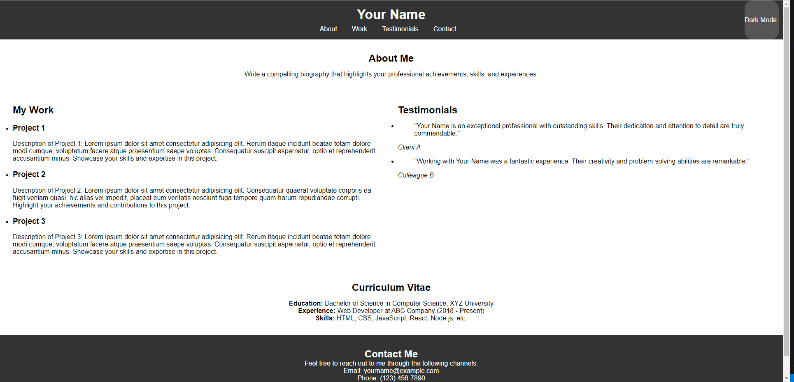
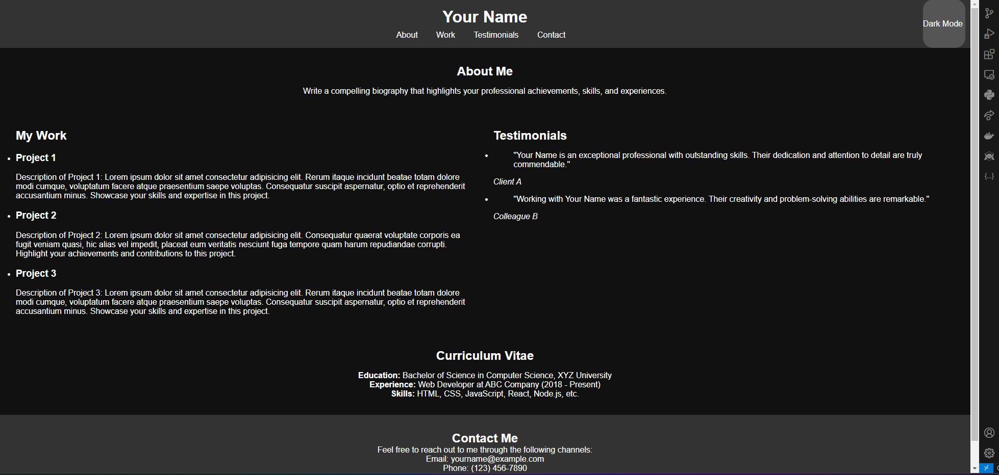

# CV Profile Website Template




## Table of Contents

- [Introduction](#introduction)
- [Getting Started](#getting-started)
  - [Create New Repository from Template](#create-new-repository-from-template)
  - [Download the ZIP](#download-the-zip)
  - [Clone the Repository](#clone-the-repository)
- [Features](#features)
- [Technologies Used](#technologies-used)
- [How to Use the Dark Mode Switch](#how-to-use-the-dark-mode-switch)
- [Contributing](#contributing)
- [License](#license)


## Introduction

Welcome to the CV Profile Website Template! This template provides a simple and elegant way to showcase your skills, experiences, and personality through an online portfolio. It's designed to help job seekers, freelancers, and professionals create an impressive CV profile website that stands out from the crowd.

## Getting Started

To use this template, you have three options:

### Create New Repository from Template

- Click on the "Use this template" button located at the top of this repository.
- Follow the prompts to create a new repository based on this template.
- Clone the newly created repository to your local machine.
- Customize the content in the `index.html` file with your own information and projects.
- Optionally, modify the `style.css` file to change the appearance of the website.
- Add any additional pages or sections as needed for your CV profile.

### Download the ZIP

- Click on the "Code" button located at the top of this repository.
- Select "Download ZIP" to download the entire template to your local machine.
- Extract the ZIP file and open the `index.html` file in a code editor.
- Customize the content in the `index.html` file with your own information and projects.
- Optionally, modify the `style.css` file to change the appearance of the website.
- Add any additional pages or sections as needed for your CV profile.

### Clone the Repository

- Alternatively, you can clone this repository to your local machine using Git.
- Open your terminal or command prompt and run the following command:
    ```git
    git clone 
    ```
- Customize the content in the `index.html` file with your own information and projects.
- Optionally, modify the `style.css` file to change the appearance of the website.
- Add any additional pages or sections as needed for your CV profile.

## Features

- **About Me:** Highlight your professional journey, achievements, and skills.
- **My Work:** Showcase a selection of your past projects and portfolio.
- **Testimonials:** Display testimonials from former employers and colleagues.
- **Curriculum Vitae:** Present a well-formatted and visually appealing CV.
- **Contact Me:** Provide various communication channels for visitors to get in touch with you.

## Technologies Used

- HTML5
- CSS3
- JavaScript

## How to Use the Dark Mode Switch

This template includes a Dark Mode switch. To toggle between Dark Mode and Light Mode, simply click on the "Dark Mode" button in the top right corner of the navbar.

## Contributing

Contributions to improve this template are welcome! If you have any suggestions or find any issues, feel free to create an issue or submit a pull request.

## License

This project is licensed under the [MIT License](LICENSE).


Thank you for using the CV Profile Website Template! Happy coding!
